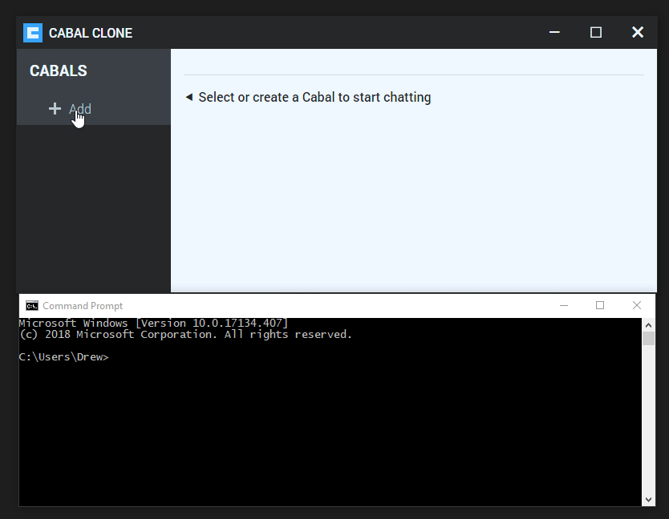

# cabal-clone

Another full-featured desktop client for cabal, with a more Metro-ey theme. 

Compared to cabal-desktop:

Added features: You can join a cabal by an arbitrary "invite code". In other words, come up with a passphrase or a group name and you can chat across the ether without any more coordination.

